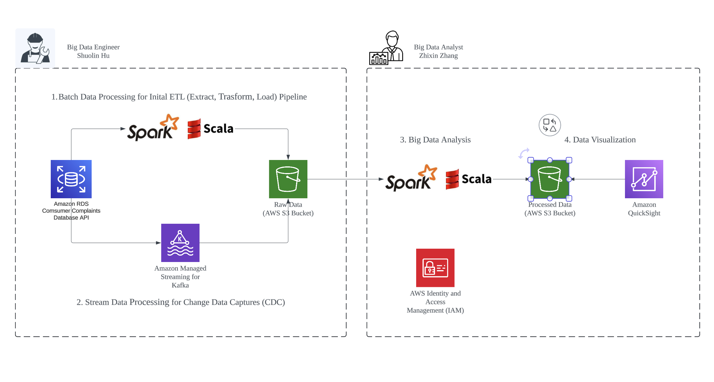

# Stream Data Pipeline using Scala and AWS

This project focuses on the Initial Bulk Data Load phase for processing large datasets using Scala and AWS services. It outlines a comprehensive, step-by-step plan to establish a baseline of data for subsequent processing.

## Architecture

## Table of Contents
- [Stream Data Pipeline using Scala and AWS](#initial-bulk-data-load-using-scala-and-aws)
  - [Table of Contents](#table-of-contents)
  - [Step 1: Define Data Sources and Requirements](#step-1-define-data-sources-and-requirements)
    - [Identify Data Sources](#identify-data-sources)
    - [Data Requirements](#data-requirements)
  - [Step 2: Setup Your Development Environment](#step-2-setup-your-development-environment)
    - [Scala Environment](#scala-environment)
    - [AWS Credentials](#aws-credentials)
  - [Step 3: Design Your Data Model](#step-3-design-your-data-model)
    - [Schema Definition](#schema-definition)
    - [Storage Format](#storage-format)
  - [Step 4: Set Up AWS Services](#step-4-set-up-aws-services)
    - [Amazon S3](#amazon-s3)
    - [AWS IAM](#aws-iam)
  - [Step 5: Develop Data Extraction Logic](#step-5-develop-data-extraction-logic)
    - [API Integration](#api-integration)
    - [Data Transformation](#data-transformation)
  - [Step 6: Implement Data Loading Mechanism](#step-6-implement-data-loading-mechanism)
    - [Batch Processing](#batch-processing)
    - [Error Handling](#error-handling)
  - [Step 7: Testing and Validation](#step-7-testing-and-validation)
    - [Local Testing](#local-testing)
    - [End-to-End Testing](#end-to-end-testing)
  - [Step 8: Automation and Scheduling](#step-8-automation-and-scheduling)
    - [Job Scheduling](#job-scheduling)
    - [Monitoring](#monitoring)

## Step 1: Define Data Sources and Requirements
### Identify Data Sources
Determine where your data is coming from—APIs, databases, or other data stores.

### Data Requirements
Understand the structure, format, and volume of the data. Define necessary data transformations.

## Step 2: Setup Your Development Environment
### Scala Environment
Ensure you have a Scala development environment ready, including an IDE like IntelliJ IDEA and Scala build tools like sbt.

### AWS Credentials
Set up your AWS credentials locally to interact with AWS services like S3, Lambda, or EMR during local testing.

## Step 3: Design Your Data Model
### Schema Definition
Define the schema for how data will be stored in AWS, considering future query and access patterns.

### Storage Format
Decide on the storage format (e.g., Parquet, JSON, CSV) based on usage patterns and performance considerations.

## Step 4: Set Up AWS Services
### Amazon S3
Create and configure S3 buckets for storing the bulk data. Set up appropriate bucket policies and permissions.

### AWS IAM
Ensure necessary IAM roles and policies are in place for secure access to S3 and other services.

## Step 5: Develop Data Extraction Logic
### API Integration
Write Scala code to interact with source APIs, handling authentication, pagination, and rate limiting.

### Data Transformation
Implement data cleaning, normalization, and transformation logic in Scala.

## Step 6: Implement Data Loading Mechanism
### Batch Processing
Use libraries like Apache Spark for efficient large-volume data processing. Develop Spark jobs in Scala to apply transformations and output to S3.

### Error Handling
Implement robust error handling and retry mechanisms.

## Step 7: Testing and Validation
### Local Testing
Test data extraction and loading scripts locally with a subset of the data to ensure functionality.

### End-to-End Testing
Conduct end-to-end testing to verify that data is correctly loaded into S3.

## Step 8: Automation and Scheduling
### Job Scheduling
Set up job scheduling using AWS services like Lambda or Batch to automate data loading.

### Monitoring
Implement monitoring and alerting with Amazon CloudWatch to track the process's performance and health.

